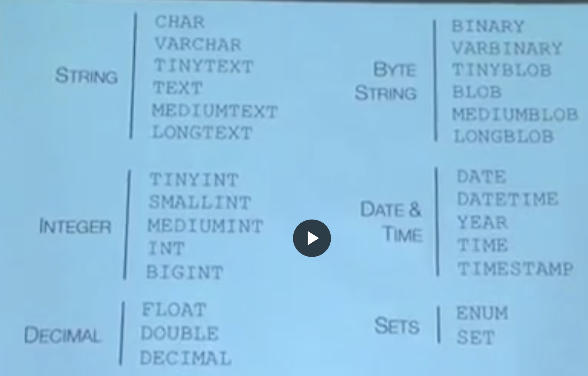

# SQL -

1. XPath
    - if your iterate through the dom, you can extract the item you want .
    - Alternatively, you can use xpath
    - [syntax](https://www.w3school.com.cn/xpath/xpath_syntax.asp)


2. TOOLS for learning sql with php:
    - PHP _PHP Data Objects_(PDO) for database accessing.
    It is a database access layer providing a uniform method of access
    to multiple databases.
    - PHPMyAdmin

3. Mostly used SQL queries:
    - CREATE
    - ALTER
        - `ALTER [UNIQUE] INDEX <index name> ON <table name> (<column(s)>);`
        - e.g `alter unique index id on users(name, age)`
    - DROP
    - SELECT
    - INSERT
    - UPDATE
    - DELETE

4. VARCHAR,  and TEXT
    - "varchar 255" is the default
    - varchar takes overhead to managing, while fix length CHAR is easier to index and constant accessing time
    - The SQL Server 2005 introduced this varchar(max) data type.
    It replaces the large blob object Text, NText and Image data types.
    All these data types can store data up to 2 GB.
    - As you might be aware that the basic unit of storage in SQL Server
    is a _page_. The page size is 8 KB (8192 byes) in SQL Server,
    and __it is fixed__. On a page, SQL Server uses 96 bytes for the page
    header. We can store 8096 bytes ( 8192-96 bytes) for data in SQL Server.
    - The effective maximum length of a VARCHAR in MySQL 5.0.3
    and later is subject to the maximum row size (65,535 bytes,
    which is shared among all columns) and the character set used.
    For example, utf8 characters can require up to three bytes per character,
    so __a VARCHAR column that uses the utf8 character set can be declared to be
    a maximum of 21,844 characters__.

5. Useful php_sql func:
    - `mysql_real_escape_string`A way to defend against malicious user input attack:
        ```
        $sql = sprintf("select * from users where user='%s' ",
                        mysql_real_escape_string($_POST["user"]))
        ```
    - `mysql_num_rows(mysql_query($sql))`=> minimise the amount of data transferred

6. Given table users indexed with field "user", to do php validation,
the diff between the followings are:
    ```
    select pass from user where user='$_POST["user"]';
    select 1 from user where user='$_POST["user"]' and pass='$_POST["pass"]';
    ```
    - The first one is indexed search, while the second one is an __exhaustive search__

7. Native functions in SQL to encrypt password:
    - `PASSWORD('%s')` => returns ASCLL string, can be stored in `varchar(255)` column
    - `AES_ENCRYPT('%s','secret')` => returns binary string that can
    not be stored in `varchar` COLUMN in a SQL TABLE. SO use `varbinary(255)`
    - a more secure way to use AES_ENCRYPT: `AES_ENCRYPT('%user_input_pass','%user_input_pass')`

8. Database normalization VS de-normalization:
    - normalization: one table => multiple tables; reduce data redundancy

9. ATOMIC ACTIONS MECHANISM :
    - TRANSACTION
        - `START TRANSACTION;`+`...`+`COMMIT;`
        - `START TRANSACTION;`+`...`+`ROLLBACK;`
    - LOCK TABLE
        - `LOCK TABLES account WRITE` + `...` + `UNLOCK TABLES`
        - THERE IS ALSO A READ LOCK, __WHICH BANS EVERYONE FROM WRITING, WHILE
        WRITE THE LOCK ONLY MAKE SURE ONE USER'S WRITE IS ATOMIC__.

10. SQL data-types:


---
* "Next line":
    - linux \n
    - win \r\n
    - mac \r

*