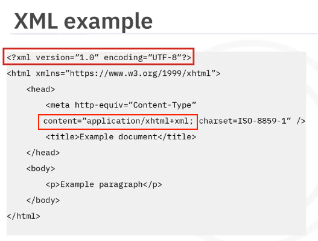
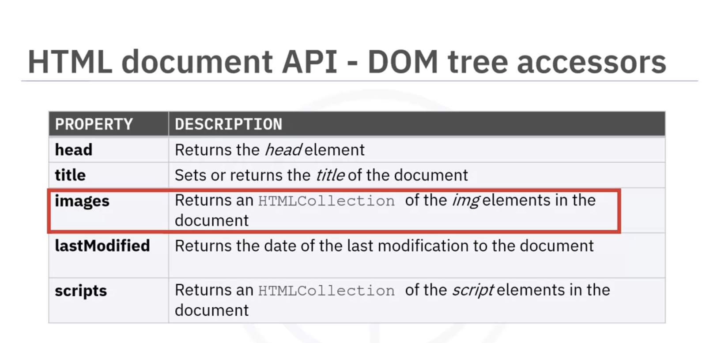
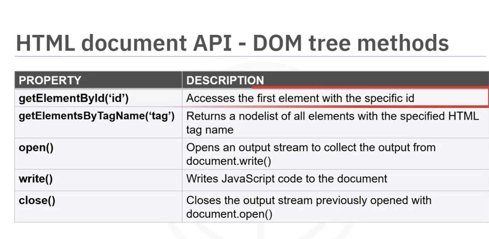
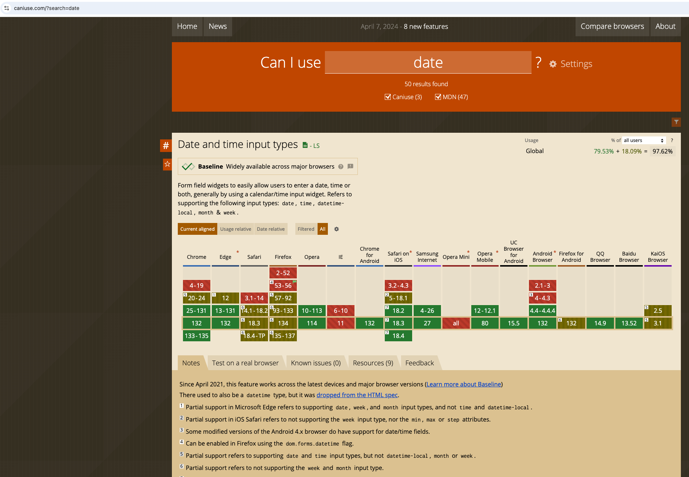

# Hypertext Markup Language (HTML)

HTML stands for Hypertext Markup Language, which can be thought of as “the language of the Internet.” It is a markup language that was originally designed for sharing scientific documents.

HTML has been in continuous evolution since it was introduced to the Internet in the early 1990s by CERN: The European Organization for Nuclear Research and the IETF: Internet Engineering Task Force. The World Wide Web Consortium (W3C) made a number of recommendations to the HTML standards over the years.

___HTML Elements___ are the building blocks of an HTML page.

- [Hypertext Markup Language (HTML)](#hypertext-markup-language-html)
  - [HTML5](#html5)
    - [New Features in HTML5](#new-features-in-html5)
    - [Performance Improvements in HTML5](#performance-improvements-in-html5)
    - [HTML5 specific Tags \& Structural Elements](#html5-specific-tags--structural-elements)
      - [aside and figure](#aside-and-figure)
      - [header and footer](#header-and-footer)
      - [nav](#nav)
      - [article and seciton](#article-and-seciton)
  - [XML](#xml)
    - [XHTML VS HTML](#xhtml-vs-html)
- [Get started with HTML](#get-started-with-html)
  - [HTML DOM tree](#html-dom-tree)
  - [HTML Scripting](#html-scripting)
    - [Enabling of scripting](#enabling-of-scripting)
    - [sandbox browsing in browser context \& iframe](#sandbox-browsing-in-browser-context--iframe)
  - [HTML5 Browser support](#html5-browser-support)
    - [HTML Browser support validation fallback](#html-browser-support-validation-fallback)
- [References](#references)


## HTML5

HTML5 is defined in a way that it is compatible with earlier versions in the way browsers handle deployed content. __It separates conformance requirements for user agents and authors__. In other words, how browsers treat HTML5 code and how page authors treat HTML5 code is different. For user agents, HTML5 is defined in a way that supports elements and attributes of the earlier specifications. For authors, several elements and attributes have been removed in order to simplify the language. 

When speaking about about creating web pages, developers may use the terms HTML and HTML5 interchangeably.

HTML5 can be written in HTML or XML. The syntax of html5 are compatible with html4 and xhtml1.

### New Features in HTML5

- HTML5 offers new and refined APIs for __video and audio__ elements, __offline web apps__ and __drag and drop__:
  - canvas, audio and video

- HTML5 elements enable you to define web page structure and content with __Structural Elements__:
  - sections, article, header, footer, figure, and figcaption

- __Input elements can automatically be validated by the browser__
  - tel, email, datetime, number, range, and color

- ___Web Storage APIs___ can store data in the the browser
  - localStorage, sessionStorage


### Performance Improvements in HTML5
- imporved search indexing with __meta tags__
- better __page load times__
- enhanced user experience

### HTML5 specific Tags & Structural Elements


#### aside and figure
- `<aside>`
  - provides additional information that is related to the main discussion
  - extracts and displays further content or navigates to additional resources __without detracting from the main discussion, and is often placed as a sidebar in a document.__
  - Used for __cautions, notes, or to wrap navigational links__
  - While the `<aside>` element itself is not displayed different from the rest of the content, it is useful for understanding your code and for styling purposes.
- `<figure>`
  - a self contained element referred to from the main content
  - emgbeds graphics, photographs, or code segments
  - __can be moved to an appendix__ without affecting the flow of the document
  - `<figurecaption>` defines the __caption__ for the contents of the `<figure>` element 

#### header and footer
- The `<header>` element is a container used to define the introductory/header information of a page. It can be used for a __navigational bar, or to wrap a table of contents__.
- An HTML document __can contain more than one `<header>` elements__, however, __they cannot be placed within `<address>`, `<footer>`, or other `<header>` elements__.
- `<footer>` element defines the area at the bottom of the page (known as a footer). This often contains copyright information, contact information, and contact links.


#### nav
- example
```html
<body>
 <nav>
   <div class="menu">
     <a href="#">Home</a>
     <a href="about.html">About</a>
     <a href="register.html">Register</a>
     <a href="#">Sign in</a>
   </div>
 </nav>
 <h1>Page Heading</h1>
</body>  
```
#### article and seciton
- Q: difference between `<section>` and `<div>`
  - `<section>` element is grouped in a semantically meaningful way, that is, there is a reason, other than for styling purposes for putting the content together.
  - Content within a `<section>` tag has a theme, which is usually indicated by a heading tag (e.g. `<h1>`) used immediately after the opening `<section>` tag.
- An `<article>` element is even more specific than a `<section>`. It is used to group together semantically related, self-contained content which can be meaningful on its own. Similar to the `<section>` element, __articles usually have headings immediately after their opening tag to indicate what the article is about__.

## XML

An "eXtensible Markup Language" Designed to store and transport data allowing users to define their own markup languages, primarily to display documents on the web.



Extensible Markup Language (XML) documents look similar to HTML documents, except __they have an XML tag on the first line__. In addition, with XML documents, the __Content-type must be specified as an XML media type such as application or xml__. When a document is transmitted with an XML content type, it is treated as an XML document by a web browser and __an XML processor parses the document__. 


### XHTML VS HTML
In terms of syntax, html5 is compatible with html4 and xhtml1 documents.

Both HTML and XHTML use the same semantic or tags. But XHTML is more strict than HTML:
 - XHTML tags all need to be in __lowercase__, while the case used does not matter in HTML. 
 - In addition, XHTML __must be well-formed. Every element must have an end tag__. All attributes must have __a value and double or single quotation marks__ must surround __all attribute values__. 
 
 __Q: if an XHTML parser encounters a situation where the syntax is not well-formed, will it stop processing? what about html?__

 - An XHTML parser will stop processing if it encounters a syntax error. XHTML is based on XML, which is stricter than HTML. Since XML parsers enforce well-formedness rules, encountering an error (such as an unclosed tag or improperly nested elements) will cause the parser to terminate and possibly report an error. 
- However, in HTML, different case, unmatched quotation marks, and non-terminated and uncontained elements are allowed and commonplace. In this regard, __HTML syntax is less rigorous than XHTML syntax__.

__Q: how to specify XHTML from server side?__
- If you want the browser to parse the document as XHTML, the server should send `Content-Type: application/xhtml+xml`
- And the document should have this format:
```
<?xml version="1.0" encoding="UTF-8"?>
<!DOCTYPE html PUBLIC "-//W3C//DTD XHTML 1.0 Strict//EN" "http://www.w3.org/TR/xhtml1/DTD/xhtml1-strict.dtd">
<html xmlns="http://www.w3.org/1999/xhtml" lang="en>

<head>
    <title>XHTML Example</title>
</head>
<body>
    <p>This is an XHTML document.</p>
</body>
</html>
```
- The `<?xml version="1.0" encoding="UTF-8"?>` declaration is optional but recommended.
- `<!DOCTYPE html PUBLIC "-//W3C//DTD XHTML 1.0 Strict//EN" "http://www.w3.org/TR/xhtml1/DTD/xhtml1-strict.dtd">` => This is a DOCTYPE declaration for XHTML 1.0 Strict, which tells the browser and validators what type of document they are dealing with.
  - `<!DOCTYPE html>` → Declares that this is an HTML/XHTML document.
  - `PUBLIC "-//W3C//DTD XHTML 1.0 Strict//EN"` → This means:
    - `"-//W3C//DTD"` → This document follows a W3C-defined __Document Type Definition (DTD)__.
    - `"XHTML 1.0 Strict"` → The document conforms to ___XHTML 1.0 Strict rules___.
      - XHTML 1.0 Strict is a stricter, XML-based version of HTML that: 
        ✅ Enforces proper element nesting and closing.
        ✅ Requires lowercase tag names.
        ✅ __Does not allow presentational attributes like <font> or inline style in elements (CSS must be used instead)__.
    - `"EN"` → The language of the DTD is English.
- The `xmlns="http://www.w3.org/1999/xhtml"` attribute is required in `<html>`.
# Get started with HTML
```
<!DOCTYPE html>
<html>
    <head>
        see ./htmlCheetSheet.html
    </head>
    <body>
        see ./htmlCheetSheet.html
    </body>
</html>
```
- The `<!DOCTYPE>` declaration is not an HTML tag; it is an instruction to the web browser about what version of HTML the page is written in. Although this declaration is not required, it should be the first line of the HTML code if the developer decides to include it. __The `<!DOCTYPE html>` is used for HTML5.__
- The `<html>` tag is the root element of this tree.

## HTML DOM tree

HTML user agents, commonly known as browsers, parse the markup, turning it into a DOM (Document Object Model) tree. A DOM tree is an __in-memory representation of a document__. DOM trees contain ___nodes, which define the type of document and its structure, such as headers and paragraphs, text nodes, and comment nodes__.=> Nodes are the building blocks of HTML



- The `document.images` property returns a live HTMLCollection of all the `` elements in the document. This collection is automatically updated when images are added or removed from the document.





## HTML Scripting

### Enabling of scripting

Scripting is enabled in a browser context when the following conditions apply:
- the __browser supports scripting__
- the user has __scripting enabled__
- the __browser context does not have the sandboxed browsing content flag set__, meaning that __the web page or iframe is not running in a sandboxed environment__ 
  - example of setting the sandbox restriction on page level `<meta http-equiv="Content-Type" content="text/html-sandboxed; ...">`
  - example of setting the sandbox restriction as an attribute for embedded objects, such as `iframe`: `<iframe src="example.html" sandbox></iframe>`.The sandbox attribute can also take a list of restrictions to apply:  `<iframe src="example.html" sandbox="allow-scripts allow-same-origin"></iframe>`. This example allows scripts to run and allows the content to be treated as being from the same origin.

### sandbox browsing in browser context & iframe

A sandboxed environment restricts certain actions and capabilities of the content to enhance security. __For example, it can prevent scripts from running, disallow form submissions, or block access to certain APIs__.

When the sandboxed browsing context flag is not set, the content has more freedom and fewer restrictions. This can be useful for functionality but may pose security risks if the content is not trusted. Specifically, __running a page that contains an embedded object without the sandbox attribute grants the embedded object the same permissions as the rest of your page__. This implicitly gives a third-party vendors permission to run scripts with the same permissions that you have for that page, __which is one way that you can inadvertently allow advertisements to occur in your application__. So, to prevent granting implicit permissions to embedded objects, use the sandbox attribute on any tag that contains an embedded object. 

## HTML5 Browser support

- we can use https://caniuse.com/ to check browser support for capabilities and events for various browsers like Chrome, firefox ...

example:


### HTML Browser support validation fallback


# References

Here is a list of resources that may be helpful as you continue your learning journey.

HTML Elements Reference (Mozilla)

https://developer.mozilla.org/en-US/docs/Web/HTML/Element

The Form Element (Mozilla)

https://developer.mozilla.org/en-US/docs/Web/HTML/Element/form

What is the Document Object Model? (W3C)

https://www.w3.org/TR/WD-DOM/introduction.html

ARIA in HTML (W3C via Github)

https://w3c.github.io/html-aria/

ARIA Authoring Practices  (W3C)

https://www.w3.org/TR/wai-aria-practices-1.2/