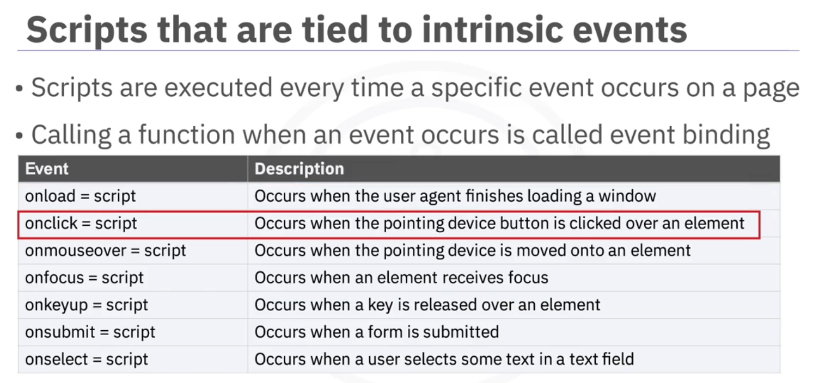
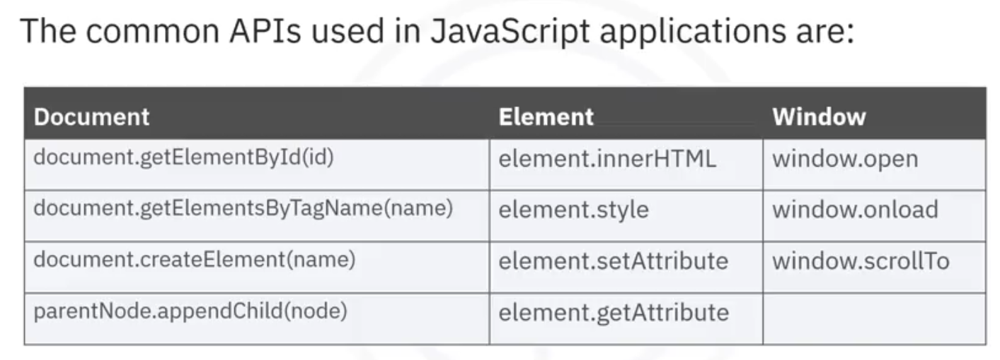
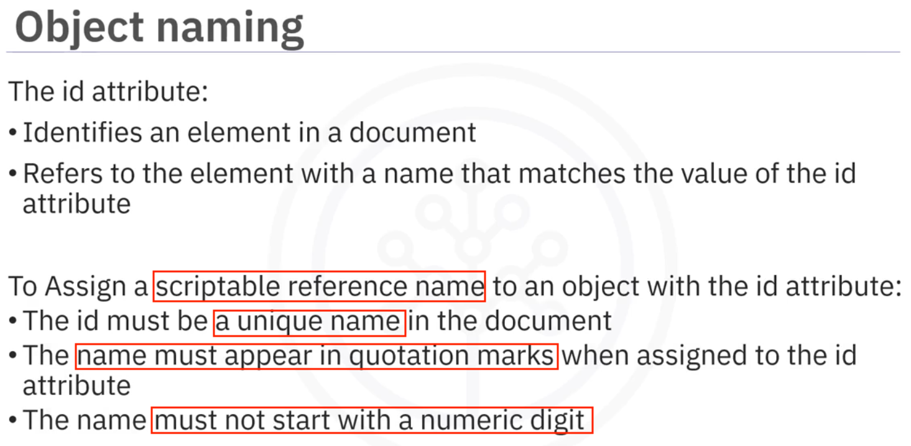

# Client Side JS

- [Client Side JS](#client-side-js)
  - [Two ways to embed JS in HTML](#two-ways-to-embed-js-in-html)
    - [`script` in `<head>` or `<body>`](#script-in-head-or-body)
  - [`<noscript>` tag](#noscript-tag)
  - [Trigger Script on Intrinsic Events](#trigger-script-on-intrinsic-events)
  - [Common JS APIs](#common-js-apis)
    - [DOM - get element by id](#dom---get-element-by-id)
    - [DOM - get element by tag](#dom---get-element-by-tag)
    - [DOM - get elements by index or "name" attributes](#dom---get-elements-by-index-or-name-attributes)
    - [DOM - create element](#dom---create-element)
    - [Element updates](#element-updates)
    - [Window object Methods and Events](#window-object-methods-and-events)
    - [XMLHttpRequest](#xmlhttprequest)
  - [Advanced JS APIs](#advanced-js-apis)
  - [Glossaries](#glossaries)
    - [AJAX](#ajax)
  - [Cheat sheet](#cheat-sheet)

## Two ways to embed JS in HTML

1. use `<script> </script>` tag 
2. use `<script src="/source/script.js"></script>`

### `script` in `<head>` or `<body>`

1. Scripts in `<head>`:
   1. Scripts in the `<head>` are executed before the page content is loaded. => This can block the rendering of the page.
2. Scripts at the End of `<body>`: => the recommended approach for most cases.
   1. Placing the `<script>` tag just before the closing `</body>` tag ensures that the HTML content is fully loaded before the script is executed.
3. Using the `defer` Attribute:
   1. If you want to include the `<script>` tag in the `<head>` but still ensure it doesn't block the page rendering, you can use the `defer` attribute. Scripts with defer are executed __after the HTML document is fully parsed but before the `DOMContentLoaded` event__.
   2. example
   ```html
    <head>
        <script src="script.js" defer></script>
    </head>
   ```
4. Using the `async` Attribute:
   1. The `async` attribute allows the script to be downloaded in parallel with the HTML parsing and executed as soon as it is ready. => However, this can lead to __unpredictable execution order if multiple scripts are included__.
   ```html
    <head>
        <script src="script.js" async></script>
    </head>
   ```

## `<noscript>` tag

It's used to handle situations where scripts have been disabled or a certain brower doesn't support them. And in this case, developers can put a section `<noscript>` to have the unsupported browser runs the section of code within it.


## Trigger Script on Intrinsic Events 



## Common JS APIs



### DOM - get element by id



__document.getElementById__
- get __one specific__ HTML or XML element based on the id attribute in the node


### DOM - get element by tag

__document.getElementsByTagName__
- get a __NodeList__ of elements with a specified tag name
- tagName parameter can be the literal name of the HTML tag. example(retrieving all images):
    ```
    var imgSet = document.getElementsByTagName("img");
    imgSrcStr = ""
    for(var i=0; i<imgSet.length; i++) {
        imgSrcStr += "<p>Img src: "
        imgSrcStr += imgSet[i].src;
        imgSrcStr += "<\p>"
    }
    document.write(output)
    ```

### DOM - get elements by index or "name" attributes

Given
```html
<form name="my-form-name">
    <label for="name">Name: </label>
    <input type="text" id="name1" name="ny-name-field-name" placeholder="enter your name, this is a required field" required>
    <input type="submit" />
</form>
```
These are all valid ways to refer to the "name1" element:
1. `document.forms[0].elements[1]`  # elements[0] is the label element
2. `document.forms["my-form-name"].elements["ny-name-field-name"]`
3. `document.my-form-name.my-name-field-name`

### DOM - create element

__document.createElement(tagName)__

Example: createElement and insertBefore
```html
<!DOCTYPE html>
<html lang="en">
<head>
    <meta charset="UTF-8">
    <meta name="viewport" content="width=device-width, initial-scale=1.0">
    <title>Example: createElement and insertBefore</title>
</head>
<body>
    <div id="container">
        <p id="first">This is the first paragraph.</p>
        <p>This is the second paragraph.</p>
    </div>

    <script>
        // Step 1: Create a new element
        var newParagraph = document.createElement("p");
        newParagraph.textContent = "This is a new paragraph inserted before the first one.";

        // Step 2: Get the parent element and the reference element
        var container = document.getElementById("container");
        var firstParagraph = document.getElementById("first");

        // Step 3: Insert the new element before the reference element
        container.insertBefore(newParagraph, firstParagraph);
    </script>
</body>
</html>
```
Example: createElement, appendChild, and replaceChild
```html
<!DOCTYPE html>
<html lang="en">
<head>
    <meta charset="UTF-8">
    <meta name="viewport" content="width=device-width, initial-scale=1.0">
    <title>Example: createElement, appendChild, and replaceChild</title>
</head>
<body>
    <div id="container">
        <p id="first">This is the first paragraph.</p>
        <p id="second">This is the second paragraph.</p>
    </div>

    <script>
        // Step 1: Create a new element
        var newParagraph = document.createElement("p");
        newParagraph.textContent = "This is a new paragraph added to the container.";

        // Step 2: Append the new element to the container
        var container = document.getElementById("container");
        container.appendChild(newParagraph);

        // Step 3: Create another new element to replace an existing one
        var replacementParagraph = document.createElement("p");
        replacementParagraph.textContent = "This paragraph has replaced the second paragraph.";

        // Step 4: Replace the second paragraph with the new one
        var secondParagraph = document.getElementById("second");
        container.replaceChild(replacementParagraph, secondParagraph);
    </script>
</body>
</html>
```
Tip: to get hold of the document root itself as the "parent" to append, use `document.body.appendChild`.

### Element updates

__element.innerHTML__
- __retrieves or sets__ the contents within an HTML element
- returns __ALL CHILD__ elements as a __text string__

__element.style__
- update the style of an element

__element.setAttribute(attrName, attrValue)__
```js
document.getElementById("theImageId").setAttribute("src", "another.gif")
```

__element.removeAttribute(attrName)__
- Removes an attribure from an element

__element.getAttribute(attrName)__
- get the attribute value __if it exists__

__element.value__
The `value` property is available on certain HTML elements, primarily `form` elements, to get or set their current value.

Example: Get the value of an input element
```html
<input type="text" id="textInput" value="Default Text">
<script>
    const inputValue = document.getElementById("textInput").value;
    console.log(inputValue); // Outputs: "Default Text"
</script>
```

Example: Get the value of a password input element
```html
<input type="password" id="passwordInput" value="mypassword">
<script>
    const passwordValue = document.getElementById("passwordInput").value;
    console.log(passwordValue); // Outputs: "mypassword"
</script>
```

Example: Get the value of a checkbox input element
```html
<input type="checkbox" id="checkbox" value="checkedValue">
<script>
    const checkboxValue = document.getElementById("checkbox").value;
    console.log(checkboxValue); // Outputs: "checkedValue"
</script>
```

Example: Get the value of a radio input element
```html
<input type="radio" name="gender" value="male">
```

Example: Get the value of a textarea element
```html
<textarea id="textArea">Default Text</textarea>
<script>
    const textAreaValue = document.getElementById("textArea").value;
    console.log(textAreaValue); // Outputs: "Default Text"
</script>
```

Example: Get the value of a dropdown element
```html
<select id="dropdown">
    <option value="option1">Option 1</option>
    <option value="option2" selected>Option 2</option>
</select>
<script>
    const selectedValue = document.getElementById("dropdown").value;
    console.log(selectedValue); // Outputs: "option2"
</script>
```

Example: Get the value of a button element
```html
<input type="button" id="button" value="Click Me">
<script>
    const buttonValue = document.getElementById("button").value;
    console.log(buttonValue); // Outputs: "Click Me"
</script>
```

### Window object Methods and Events

Window is global

It is the top most level => thus can leave out the `window` keyword: `window.some_func()` === `some_func()` 

<mark>See the <a href="./demo-window-open-onload-scrollto.html">./demo-window-open-onload-scrollto.html.html</a> for an example </mark>

__window.open__
open another window, where you can specify attributes like the size of the window

__window.onload__
Do something when the __entire page (including all resources like images)__ has fully loaded.

__window.scrollTo__

__window.alert__ 
Plain alert box
example: `alert("message")`

__window.confirm__
Confirmation, OK/Cancel dialog

__windown.prompt__
Text-entry prompt


### XMLHttpRequest

https://developer.mozilla.org/en-US/docs/Web/API/XMLHttpRequest

<mark>See the <a href="./demo-ajax_xml_http_request.html">./demo-ajax_xml_http_request.html.html</a> for an example </mark>


## Advanced JS APIs

https://developer.mozilla.org/en-US/docs/Web/API


## Glossaries

### AJAX

“Asynchronous JavaScript and XML” that encompasses more than asynchronous server calls through JavaScript and XML. It is not programming language or technology but rather a programming concept. Ajax represents a series of techniques that provide richer, interactive web applications through HTML, JavaScript, Cascading style sheets, and modifying the web page through the Document Object Model. The name is misleading though because nowadays, JSON is commonly used instead of XML.

## Cheat sheet

[pdf here](./resource/js%20cheetsheet.pdf)