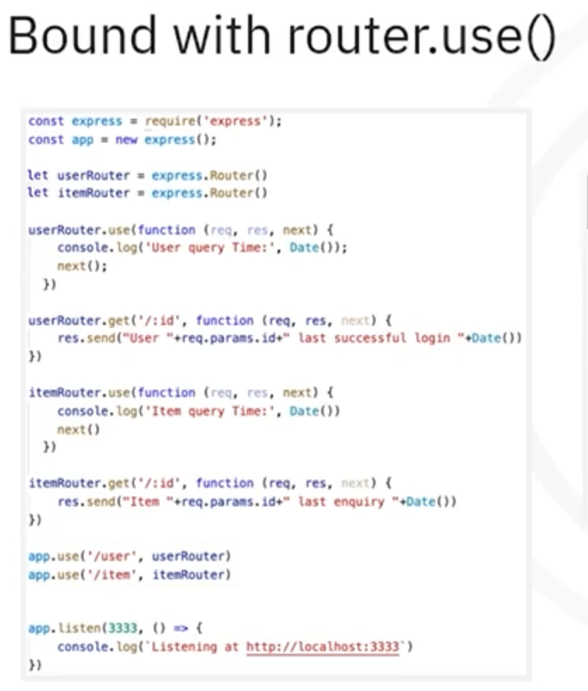

<h1>Node.js</h1>

- [Basics](#basics)
  - [Web server, application server, and DB (server)](#web-server-application-server-and-db-server)
- [Naming conventions](#naming-conventions)
- [Modules](#modules)
  - [Module Specification (CommonJS and ES modules)](#module-specification-commonjs-and-es-modules)
    - [CommonJs](#commonjs)
    - [ES Modules (ESM)](#es-modules-esm)
    - [Important Differences between CommonJS and ESM](#important-differences-between-commonjs-and-esm)
    - [Mixed module specifications](#mixed-module-specifications)
    - [Dynamic Import](#dynamic-import)
  - [Module Types](#module-types)
    - [core](#core)
    - [local](#local)
    - [third-party](#third-party)
- [Node Package Manager (NPM)](#node-package-manager-npm)
  - [local install vs global install](#local-install-vs-global-install)
  - [npm install save and save dev](#npm-install-save-and-save-dev)
- [Node.js - Callbacks \& Promises](#nodejs---callbacks--promises)
  - [Async I/O w Callback Programming](#async-io-w-callback-programming)
    - [callback examples](#callback-examples)
  - [Promises](#promises)
    - [Promise Simple Example](#promise-simple-example)
    - [Chained Promises Simple Example](#chained-promises-simple-example)
  - [Promises w Async/await](#promises-w-asyncawait)
    - [Why use Async/awairt syntax?](#why-use-asyncawairt-syntax)
    - [Just async with no await](#just-async-with-no-await)
  - [Axios - a Promise-based HTTP client](#axios---a-promise-based-http-client)
- [Express Framework](#express-framework)
  - [Hello World Single File App Example](#hello-world-single-file-app-example)
  - [Router, Middleware, and Templating](#router-middleware-and-templating)
  - [Folder Structures](#folder-structures)
  - [Env conf\&load for COMMON/DEV/STG/PROD](#env-confload-for-commondevstgprod)
    - [example - no shared default config](#example---no-shared-default-config)
    - [example - with shared default config](#example---with-shared-default-config)
    - [production-ready setup - conf + secrets storage](#production-ready-setup---conf--secrets-storage)
  - [Authentication and Authorization](#authentication-and-authorization)
    - [Session based](#session-based)
    - [Token based](#token-based)
    - [Passwordless](#passwordless)

# Basics

Node.js runs on Google Chrome's V8 engine. The V8 engine also runs on the client's front-end browser.

- Node.js is a __Runtime environment__ for server-side JS applications
- Express is a __Server-side JS web framework__, which runs on top of Node.js

## Web server, application server, and DB (server)

Web Server tools:
- Nginx
  - lightweight, high perfomance, reverse proxy and web server.
  - popular for handling static files and load balancing
- Apache HTTP server
  - one of the oldest and most widely used.
  - flexible with many modules.
- Caddy
  - modern web server with automatic HTTPS
  - configuration is simpler than Nginx/Apache

Application Server:
- Node.js
  - JS runtime, used with web app frameworks like Express or NestJS 
  - Great for real-time apps and microservices
- Spring Boot(Java)
  - Enterprise-level framework widely used in large applications
  - Handles web requests, APIs, and integrates easily with DBs
- Django (python)
  - High-level python framework
  - Includes ORM, admin panel, and strong security features.
- Honorable mentions: Ruby on Rails, ASP.NET Core

Database Server
- PostgreSQL
  - Open-source, relational database with advanced features (JSONB, indexing, etc.).
  - Known for reliability and performance.
- MySQL / MariaDB
  - Popular RDBMS; MariaDB is its open-source fork.
  - Used in many CMSs and legacy systems.
- MongoDB
  - NoSQL database storing data in flexible, JSON-like documents.
  - Good for rapid development and unstructured data.

# Naming conventions

- lower case for filenames : myfile.js
- camel case for variables: myVar
- '-' seperated lowercase char (_kebab-case_) for npm module names: my-npm-module
  - my-npm-module is not valid as a JavaScript variable directly, because - is interpreted as a minus operator.
- camel case when requiring npm modules: const myModule = require('my-npm-module');

# Modules

___module___
Modules can be a single file or a collection of multiple files and folders.

___package___
A directory with one or more modules bundled together is called a package.

## Module Specification (CommonJS and ES modules) 
___module specification___ - Module specifications are the conventions and standards used to create packages in JavaScript code for Node.js applications. 

The most commonly used module specifications for Node.js applications are __CommonJS__ and __ES modules__. 

### CommonJs

If the module file has `.js` extension, and  `package.json` DOES NOT HAVE `{"type": "module"}` specification, then, it's a CommonJS module.

- module import: 
  ```js
  const express = require('express');
  const routes = require('./routes');
  const dotenv = require('dotenv');
  ```
  - The require statement can be called __anywhere__ in the file. 
- module export: `module.exports = router;`

### ES Modules (ESM)

If module file has `.mjs` extension, then it's a ES module. But when a file has `.js` extension, but `package.json` has `{"type": "module"}` specification, it still is a ES module.

- default module import:  
  ```js
  import express from 'express';
  import routes from './routes.js';
  import dotenv from 'dotenv';
  ```
  - The import statement __must be called at the beginning__ of the file.
- default module export: `export default router;`

___ES module "named" import and export___
- named export in `module.mjs`: `const a = 1; export {a as "myvalue"}`
- corresponding named import: `import { myvalue } from module.mjs`


### Important Differences between CommonJS and ESM
- ___LOCATION___: 
  - The `require` statement is dynamic and can be __called anywhere__, including within conditional statements and functions. 
  - In contrast, `import` is static and __must be called at the beginning__ of the file. 
- ___ERROR___: 
  - Errors in `require` are detected at __runtime__.
  - While `import` binding errors are caught at __compile time__.
- ___ASYNC & SYNC___: 
  - `require` modules are __synchronous__, loading one at a time
  - `import` modules are __asynchronous__, allowing simultaneous processing. Import is faster for large-scale applications with many modules.

### Mixed module specifications

Node allows mixing CommonJS and ESM, but with some restrictions:
- You can't require() an ESM module from a CommonJS module (without dynamic import workarounds).
- You can import() a CommonJS module from an ESM module, but it treats it as a default export.

### Dynamic Import 

__In a CommonJS environment__ (i.e. `.js` file without {"type": "module"}), you cannot directly use import to load ES modules. However, you can __use the dynamic import() function to load ES modules at runtime__. This is a workaround for mixing module specifications.
```js
(async () => {
    const { default: myModule } = await import('./myModule.mjs');
    console.log(myModule);
})();
```

## Module Types

### core

Core Node.js modules form a minimal library. They contain the minimal functionality needed to develop Node.js applications.

see `./examples/core-*` folders for examples.

### local

Local modules are the modules written by you and the development team as part of creating your Node.js application.

### third-party

Third-party modules are available online and have been created by the back-end Node.js community. 

Many third-party modules are either in the public domain, which does not require a license, or they are open source. Open source resources are usually governed by the "copyleft" license, which allows the developer to use and modify the code but also requires the developer to share their work under that same license.

| Aspect       | Copyright                          | Copyleft                          |
  |--------------|------------------------------------|------------------------------------|
  | Control      | Creator retains exclusive control. | Creator allows free use with conditions. |
  | Modification | Modifications may require permission. | Modifications must remain open-source. |
  | Distribution | Restricted without explicit permission. | Free distribution is encouraged. |
  | Philosophy   | Protects intellectual property.    | Promotes collaboration and openness. |


# Node Package Manager (NPM)

NPM uses the metadata in a `package.json` file to determine a package’s dependencies.

## local install vs global install

__local install__

`npm install <package_name>`

- local install is the default
- run the local instal cmd from the directory you what the package installed in

__global install__

`npm insatll -g <package_name>`

Global installs should be used judiciously because all projects on that computer will make use of that package and its dependencies. If you have different versions of a project on your machine, they will all use the globally installed package, which might break compatibility with other dependencies. 

## npm install save and save dev

If you don’t use --save or --save-dev, the package won’t be added to package.json

🔹 Modern Note

Actually, since npm v5 (2017), you don’t need `--save` anymore — it’s the default.
- npm install express automatically saves it to "dependencies".
- You only explicitly use --save-dev if you want it in "devDependencies".

# Node.js - Callbacks & Promises
---
✅ Use callbacks when:
- You’re working with __older Node.js APIs__ (e.g., fs.readFile, http.request) that are callback-based by default.

- You want __low-level control over asynchronous flow__.

- You’re writing __small, simple asynchronous functions__ and don’t expect chaining or composition.

⚠️ Downsides of callbacks:
- ___Callback Hell___: Deep nesting when multiple async operations depend on one another.

- __Error handling__ is manual and repetitive (e.g., if (err) return callback(err)).

- Harder to compose or __chain async logic__ cleanly.

---

✅ Use promises when:
- You need to __chain multiple async__ operations (e.g., .then().then().catch()).

- You want to use __modern syntax like `async/await`__.

- You're working with __newer APIs__ or using a library that supports/returns Promises (e.g., fs.promises, axios, fetch).

- Your logic benefits from cleaner error handling with .catch() or try/catch.

⭐ Advantages of promises:
- Composable (e.g., .then() chaining)

- Can be converted to async/await, making code more synchronous-like and easier to follow.

- More readable and maintainable for complex flows.

## Async I/O w Callback Programming


### callback examples

see `function call_back_on_http_resp(resultCallback)` from [here](./nodeJsExamples/src/core_http/low_level_request.js).

## Promises

A promise is an object that is returned by an asynchronous method.

__How to define a Promise?__
- A __method can be defined to return a promise object__, if you know it is going to take time for execution and thereby block resources. 
- When you __call a method that returns a promise, a promise object is created__. 

__States/Lifecycle of a promise object__
- The initial state of the promise is the ___pending state___. It is in this state until the operation is __complete or some error has caused the operation to abort__.
- When the operation is complete, the promise is said to be ___resolved___. When there is an error, the promise is said to be ___rejected___.

### Promise Simple Example

```js
//Creating a promise method. The promise will get resolved when timer times out after 6 seconds.
let myPromise = new Promise((resolve,reject) => {
    setTimeout(() => {
      resolve("Promise resolved")
    },6000)})

//Console log before calling the promise
console.log("Before calling promise");

//Call the promise and wait for it to be resolved and then print a message.
myPromise.then((successMessage) => {
    console.log("From Callback " + successMessage)
  })

//Console log after calling the promise
  console.log("After calling promise");
```
```
Before calling promise
After calling promise
From Callback Promise resolved
```

### Chained Promises Simple Example
```js
let myPromise1 = new Promise((resolve, reject) => {
    setTimeout(() => {
        resolve("promise1 resolved")
    }, 6000)
})

let myPromise2 = new Promise((resolve, reject) => {
    setTimeout(() => {
        resolve("promise2 resolved")
    }, 3000)
})

console.log("Before calling promise1");

myPromise1.then((successMessage1) => {
    console.log("promise1 resolved with " + successMessage1)

    console.log("Before calling promise2");
    myPromise2.then((successMessage2) => {
        console.log("promise2 resolved with " + successMessage2)
        console.log("try to access promise1 successMessage1 from promise2 callback " + successMessage1)
    })
    console.log("After calling promise2");
})

console.log("After calling promise1");
```

```
Before calling promise1
After calling promise1
promise1 resolved with promise1 resolved
Before calling promise2
After calling promise2
promise2 resolved with promise2 resolved
try to access promise1 successMessage1 from promise2 callback promise1 resolved
```

## Promises w Async/await

An `async` function __always returns a Promise__. Inside the async function, you can use the await keyword to pause execution until a Promise is resolved or rejected.

### Why use Async/awairt syntax?

🌀 Without async/await (Using Promises)
```js
function getUser() {
  return new Promise(resolve => {
    setTimeout(() => resolve({ id: 1, name: 'Alice' }), 1000);
  });
}

function getOrders(userId) {
  return new Promise(resolve => {
    setTimeout(() => resolve(['order1', 'order2']), 1000);
  });
}

// Promise chaining
getUser()
  .then(user => {
    console.log('User:', user);
    return getOrders(user.id);
  })
  .then(orders => {
    console.log('Orders:', orders);
  })
  .catch(err => {
    console.error('Error:', err);
  });
```
✅ With async/await — Cleaner & More Synchronous-Looking

```js
function getUser() {
  return new Promise(resolve => {
    setTimeout(() => resolve({ id: 1, name: 'Alice' }), 1000);
  });
}

function getOrders(userId) {
  return new Promise(resolve => {
    setTimeout(() => resolve(['order1', 'order2']), 1000);
  });
}

// Async function using await
async function showUserAndOrders() {
  try {
    const user = await getUser();
    console.log('User:', user);

    const orders = await getOrders(user.id);
    console.log('Orders:', orders);
  } catch (err) {
    console.error('Error:', err);
  }
}

showUserAndOrders();
```
✨ Why This Is Easier to Read:
- Looks like synchronous code, but it's async.

- No deeply nested .then() calls.

- Easier to add logic between steps.

- try/catch is standard and familiar for error handling.

### Just async with no await

What happens under the hood
```js
async function myAsyncFunction() {
  return "done";
}
```
is roughly equivalent to writing:
```js
function myAsyncFunction() {
  return Promise.resolve("done");
}
```
And
```js
async function myAsyncFunction() {
  throw new Error("fail");
}
```
is like:
```js
function myAsyncFunction() {
  return Promise.reject(new Error("fail"));
}
```

## Axios - a Promise-based HTTP client 
---
Axios is a Promise-based HTTP client for browser and Node.js.

It simplified the process to send async http request to REST endpoints.

Support CRUD.

Transfer JSON data automatically with clean and simple API.

---

__Simple Axios GET Example__

```js
const axios = require('axios');

axios.get('https://jsonplaceholder.typicode.com/posts/1')
  .then(response => {
    console.log('Title:', response.data.title);
  })
  .catch(error => {
    console.error('Error:', error.message);
  });

```
---

__Simple Axios POST Example__

```js
const axios = require('axios');

// The `userId` field represents the ID of the user creating the post.
axios.post('https://jsonplaceholder.typicode.com/posts', {
  title: 'Hello World',
  body: 'This is a test post',
  userId: 1
})
.then(response => {
  console.log('Created Post:', response.data);
})
.catch(error => {
  console.error('Error:', error.message);
});

```

---

__Axios with Chained up Get and Post Using `async/await`__
```js
async function run() {
  try {
    const getResponse = await axios.get('https://jsonplaceholder.typicode.com/posts/1');
    console.log('GET title:', getResponse.data.title);

    const postResponse = await axios.post('https://jsonplaceholder.typicode.com/posts', {
      title: 'Another Post',
      body: 'Body text here',
      userId: 2
    });
  } catch (err) {
    console.error('Request failed:', err.message);
    console.error('Error stack:', err.stack);
  }
  }
}

run();
```

---

__Axios with Parallel up Get and Post Using `async/await`__

```js
async function run() {
  try {
    const [getResponse, postResponse] = await Promise.all([
      axios.get('https://jsonplaceholder.typicode.com/posts/1'),
      axios.post('https://jsonplaceholder.typicode.com/posts', {
        title: 'Another Post',
        body: 'Body text here',
        userId: 2,
      }),
    ]);
    
    console.log('GET title:', getResponse.data.title);
    console.log('POST result:', postResponse.data);
  } catch (err) {
    console.error('Request failed:', err.message);
  }
}

run();

```

# Express Framework

__Express.js is a backend web application framework for Node.js.__

Express is used for things like APIs and SSR (server-side rendering).

⚠️ ___Note___: express itself is still using CommonJS internally, but it can be imported via ESM because Node.js supports interop.

The named exports (like Router, json, urlencoded) are exposed on the default express export:
```js
import express from 'express';
const { Router } = express;
```
- `const { Router } = express` This uses ___destructuring assignment___ to extract the `Router` property from the express object. `Router` is a named export provided by `express`. It is used to create modular, mountable route handlers in 
Express applications.

## Hello World Single File App Example
```js
// app.js
const express = require("express");
const app = express();
app.use(express.json());  // to parse JSON bodies
app.get("/index", (req, res) => {
  res.json([{ title: "Learn Node", rating: 4 }]);  // return JSON response
});

// Visiting /users/123 sets req.params.id to "123"
app.get("/users/:id", (req, res) => {
    // Extract values from req
    const routeParam = req.params.id; // Route parameter
    const queryParam = req.query.title; // Query parameter
    const headerValue = req.headers["user-agent"]; // Header value

    console.log("Route Parameter:", routeParam);
    console.log("Query Parameter:", queryParam);
    console.log("Header Value:", headerValue);

    res.json({
        routeParam, // Equivalent to routeParam: routeParam
        queryParam,
        headerValue,
    });
});

// Visiting /books?author=JohnDoe sets req.query.author to "JohnDoe"
app.get('/books', (req, res) => {
  const author = req.query.author;  // extract ?author= value from query string
  res.send(`Filter by author: ${author}`);
});

// post: For JSON { "username": "aname", "password": "pwd123" }, 
// // req.body.username returns "aname"
app.post('/register', (req, res) => {
  const username = req.body.username;  // get value from request body
  res.send(`Username received: ${username}`);
});

app.listen(3000, () => console.log("Server running on port 3000"));
```
- `app.use(express.json()); ` : This middleware is used to parse incoming JSON payloads in HTTP requests. It converts the JSON data in the request body into a JavaScript object and attaches it to `req.body`.

## Router, Middleware, and Templating

___🔹 What is middleware?___
Middleware is any function that has this signature:

```js
(req, res, next) => { ... }
```
It gets __called in order__ during a request and can:
- Modify req or res
- Short-circuit the response
- Pass control to the next middleware using next() => even you don't use the next function, you still need to include it
---
Here are five common types of middleware in Node.js (especially with Express):

1.  __Application-level middleware__ 
    1.  Bound to the app object using app.use() or app.METHOD().
    2.  Runs for every request or specific routes.
2.  __Router-level middleware__
    1.  Bound to an instance of `express.Router()`.
    2.  Used for modular route handling.
3.  __Error-handling middleware__
    1.  Has four parameters: `(err, req, res, next)`.
    2.  Used to catch and process errors.
4.  __Built-in middleware__
    1.  Provided by Express, e.g., `express.json()`, `express.static()`.
    2.  Handles common tasks like parsing JSON or serving static files.
5.  __Third-party middleware__
    1.  Installed via npm, e.g., `morgan`, `cors`, `cookie-parser`.
    2.  Adds extra functionality like logging, CORS support, etc.


---
___Express Middleware with `app.use` & Multiple Routers Example___
Middlewares can be bound to the entire application `app.use`. Or it can be bound to specific routes. To do that, option one `app.use('/api', mymiddleware)`. Or option two:

Note: the order of `app.use` matters!

## Folder Structures

Folder Structure in Express

* Express does not enforce a directory structure (unlike Rails, Django, etc.).

* Defining a clear structure helps maintain large apps.

Common folders:

* node_modules → Auto-created by npm install, holds dependencies.

* config → Configuration files (DB connections, env variables, API keys).

* models → Data models (defined via ORM for relational/non-relational DBs).

* routes → Route files for different entities/resources.

* views → Template files (HTML, CSS, JS for dynamic rendering).

* public → Static content (images, CSS, JS). Use sub-folders by type.

Common files:

* app.js → Main configuration file for app.

* routes.js → Central entry point for routes (imports & exports them).

* package.json → Project metadata & dependency management.

For APIs only:

* No views or public folders needed.
* Structure: node_modules, config, models, routes, plus app.js, routes.js, package.json.

## Env conf&load for COMMON/DEV/STG/PROD

### example - no shared default config

We’ll use **`dotenv`** to load `.env` files.

---

**1️⃣ Project Structure Example**

```
my-express-app/
│
├── config/
│   ├── index.js          # main config loader
│   ├── dev.env           # development environment variables
│   ├── stg.env           # staging environment variables
│   └── prod.env          # production environment variables
│
├── package.json
├── server.js
└── routes/
    └── index.js
```

---

**2️⃣ Environment Files (`config/*.env`)**

`dev.env`

```
PORT=3000
DB_URI=mongodb://localhost/dev-db
API_KEY=dev-key-123
```

`stg.env`

```
PORT=4000
DB_URI=mongodb://localhost/stg-db
API_KEY=stg-key-456
```

`prod.env`

```
PORT=5000
DB_URI=mongodb://prod-db-server/prod-db
API_KEY=prod-key-789
```

---

**3️⃣ Config Loader (`config/index.js`)**

```js
const fs = require('fs');
const path = require('path');
const dotenv = require('dotenv');

// Determine current environment, default to 'dev'
const env = process.env.NODE_ENV || 'dev';

// Construct path to .env file
const envFilePath = path.resolve(__dirname, `${env}.env`);

// Load environment variables from the file if it exists
if (fs.existsSync(envFilePath)) {
  dotenv.config({ path: envFilePath });
} else {
  console.warn(`Warning: ${envFilePath} does not exist. Using system environment variables.`);
}

// Export config values as an object
module.exports = {
  port: process.env.PORT,
  dbUri: process.env.DB_URI,
  apiKey: process.env.API_KEY,
};
```

---

**4️⃣ Using Config in `server.js`**

```js
const express = require('express');
const config = require('./config');

const app = express();

// Example route
app.get('/', (req, res) => {
  res.send(`Environment: ${process.env.NODE_ENV || 'dev'}, API_KEY: ${config.apiKey}`);
});

app.listen(config.port, () => {
  console.log(`Server running in ${process.env.NODE_ENV || 'dev'} mode on port ${config.port}`);
});
```

---

**5️⃣ How to Run for Different Environments**

```bash
# Development
NODE_ENV=dev node server.js

# Staging
NODE_ENV=stg node server.js

# Production
NODE_ENV=prod node server.js
```

* Each run will load the correct `.env` file and apply the corresponding configuration.
* The `config/index.js` module abstracts environment-specific settings for easy access throughout your app.

---

✅ **Key Benefits of This Structure**

1. Clear separation of **env-specific variables**.
2. Easy to switch environments with `NODE_ENV`.
3. Centralized config object, avoids sprinkling `process.env` everywhere.
4. Works for dev, staging, and production without changing code.

---

### example - with shared default config 

With a shared defult config, the "use and run" are the same as stated above on step 4 and 5. But for 1-3, here are the new steps instead:
Perfect! Let’s create a **more advanced configuration system** for Express that merges **default values** with **environment-specific overrides**, so you don’t have to repeat shared config across `dev`, `stg`, and `prod`.

---

**1️⃣ Project Structure**

```
my-express-app/
│
├── config/
│   ├── default.js      # shared default config
│   ├── dev.js          # development overrides
│   ├── stg.js          # staging overrides
│   ├── prod.js         # production overrides
│   └── index.js        # config loader
│
├── package.json
└── server.js
```

---

**2️⃣ Default Config (`config/default.js`)**

```js
module.exports = {
  port: 3000,
  dbUri: 'mongodb://localhost/default-db',
  apiKey: 'default-key',
  logLevel: 'info',        // example shared setting
};
```

---

**3️⃣ Environment Overrides**

`config/dev.js`

```js
module.exports = {
  port: 3000,
  dbUri: 'mongodb://localhost/dev-db',
  apiKey: 'dev-key-123',
  logLevel: 'debug',
};
```

`config/stg.js`

```js
module.exports = {
  port: 4000,
  dbUri: 'mongodb://localhost/stg-db',
  apiKey: 'stg-key-456',
};
```

`config/prod.js`

```js
module.exports = {
  port: 5000,
  dbUri: 'mongodb://prod-db-server/prod-db',
  apiKey: 'prod-key-789',
  logLevel: 'error',
};
```

---

**4️⃣ Config Loader (`config/index.js`)**

```js
const merge = require('lodash.merge');

// Load default config
const defaultConfig = require('./default');

// Determine environment
const env = process.env.NODE_ENV || 'dev';

// Load environment-specific config
let envConfig = {};
try {
  envConfig = require(`./${env}`);
} catch (err) {
  console.warn(`No config file found for environment "${env}", using defaults.`);
}

// Merge default config with environment overrides
const config = merge({}, defaultConfig, envConfig);

module.exports = config;
```

> Here we use `lodash.merge` to **deep merge** default and environment-specific configs.
> You can install it via: `npm install lodash.merge`

---


✅ Advantages of this Approach

1. **No repetition**: common settings are in `default.js`.
2. **Flexible overrides**: environment files only specify what differs.
3. **Deep merge support**: nested objects in config can also be merged.
4. **Clean and maintainable**: easy to add new environments later.

---

### production-ready setup - conf + secrets storage

1. **Default config + environment-specific overrides**
2. **`.env` files for secrets** (API keys, DB passwords, etc.)

With a shared defult config, the "use and run" are the same as stated above in the first example on step 4 and 5. But for 1-3, here are the new steps instead:

**1️⃣ Project Structure**

```
my-express-app/
│
├── config/
│   ├── default.js
│   ├── dev.js
│   ├── stg.js
│   ├── prod.js
│   └── index.js       # merges configs and loads env variables
│
├── .env.dev           # secrets for development
├── .env.stg           # secrets for staging
├── .env.prod          # secrets for production
├── package.json
└── server.js
```

---

**2️⃣ Default Config (`config/default.js`)**

```js
module.exports = {
  port: 3000,
  dbUri: 'mongodb://localhost/default-db',
  logLevel: 'info',
};
```

---

**3️⃣ Environment Overrides (`config/dev.js`, `config/stg.js`, `config/prod.js`)**

`config/dev.js`

```js
module.exports = {
  port: 3000,
  dbUri: 'mongodb://localhost/dev-db',
  logLevel: 'debug',
};
```

`stg.js` and `prod.js` will override only what changes:

```js
// stg.js
module.exports = {
  port: 4000,
  dbUri: 'mongodb://localhost/stg-db',
};

// prod.js
module.exports = {
  port: 5000,
  dbUri: 'mongodb://prod-db-server/prod-db',
  logLevel: 'error',
};
```

---

**4️⃣ Environment Files (`.env.*`)**

`.env.dev`

```
API_KEY=dev-secret-key
DB_PASSWORD=dev-password
```

`.env.stg`

```
API_KEY=stg-secret-key
DB_PASSWORD=stg-password
```

`.env.prod`

```
API_KEY=prod-secret-key
DB_PASSWORD=prod-password
```

> **Tip:** Add all `.env.*` files to `.gitignore` to keep secrets out of source control.

---

**5️⃣ Config Loader (`config/index.js`)**

```js
const fs = require('fs');
const path = require('path');
const dotenv = require('dotenv');
const merge = require('lodash.merge');

// Determine environment
const env = process.env.NODE_ENV || 'dev';

// Load default config
const defaultConfig = require('./default');

// Load environment-specific config
let envConfig = {};
try {
  envConfig = require(`./${env}`);
} catch (err) {
  console.warn(`No config file for environment "${env}", using defaults.`);
}

// Load environment variables from .env file
const envFilePath = path.resolve(__dirname, `../.env.${env}`);
if (fs.existsSync(envFilePath)) {
  dotenv.config({ path: envFilePath });
} else {
  console.warn(`No .env file for environment "${env}"`);
}

// Merge configs
const config = merge({}, defaultConfig, envConfig, {
  apiKey: process.env.API_KEY,
  dbPassword: process.env.DB_PASSWORD,
});

module.exports = config;
```

---

✅ **Key Benefits**

* All shared defaults live in `default.js`.
* Only environment-specific overrides go into `dev.js`, `stg.js`, `prod.js`.
* Secrets are kept in `.env` files (never hardcoded).
* Config merging ensures everything is accessible via a single `config` object.
* Easy to maintain and extend for new environments.

---

If you want, I can also show a **version where nested objects (like DB settings) merge seamlessly from both config files and `.env`**, which is even more robust for large apps.

Do you want me to do that?


## Authentication and Authorization

There are three main methods of Auth: session based, token based, and passwordless

### Session based
This is the oldest form of auth.

___How to___
  1. The user uses their credentials to log in.
  2. On Server side, the login credentials are verified against the credentials in a database. 
     1. _The database is responsible for storing which resources can be accessed based on the session ID._
  3. __The server creates a session with a session ID that is a unique encrypted string. The session ID is stored in the database__.
  4. __Then, on client side, the session ID is also stored in the browser as a cookie__.
  5. When the user logs out or a specified amount of time has passed, the session ID is destroyed on both the browser and the database.

___Code example in Node JS Express___
```js
const express = require('express');
const session = require('express-session');
const app = express();
// Middleware to set up session management
app.use(session({
  secret: 'secret-key',      // Replace with a strong secret key
  resave: false,             // Whether to save the session data if there were no modifications
  saveUninitialized: true,   // Whether to save new but not modified sessions
  cookie: { secure: false }  // Set to true in production with HTTPS
}));
// POST endpoint for handling login
app.post('/login', (req, res) => {
  const { username, password } = req.body;
  // Simulated user authentication (replace with actual logic)
  if (username === 'user' && password === 'password') {
    req.session.user = username;  // Store user information in session
    res.send('Logged in successfully');
  } else {
    res.send('Invalid credentials');
  }
});
// GET endpoint for accessing dashboard
app.get('/dashboard', (req, res) => {
  if (req.session.user) {
    res.send(`Welcome ${req.session.user}`);  // Display welcome message with user's name
  } else {
    res.send('Please log in first');
  }
});
// Start the server on port 3000
app.listen(3000, () => console.log('Server running on port 3000'));
```
### Token based

Token-based authentication uses ___access tokens___ to validate users. An access token is a small piece of code that contains information about the user, __their permissions, groups, and expirations__ that get passed from a server to the client. 

An ___ID token___ is an artifact that proves that the user has been authenticated.


__The token contains three parts__: the header, the payload, and the signature. 
- The header contains information about the type of token and the algorithm used to create it. 
- The payload contains user attributes, called claims, such as permissions, groups, and expirations. 
- The signature verifies the token's integrity, meaning that the token hasn't changed during transit.

__How To__
- A user's __browser__ makes a call to an ___authentication server___ and gets access to a web application. 
- The authentication server then passes back an __ID token__ which is stored by the client __as an encrypted cookie__. 
- The ID token is then passed to the __app on the web server__ as proof that the user has been authenticated.

__ID Token VS Access Token__
ID token only verifies Authentication, Access Token handles Authorization.
A JWT token with a "role/scope/permissions" key would be an Access Token.
Typical Token Response from Auth Server would have __SEPERATE__ ID token and access token
```json
{
  "access_token": "eyJhbGciOiJIUzI1NiIsInR5cCI6...",
  "id_token": "eyJhbGciOiJSUzI1NiIsImtpZCI6...",
  "token_type": "Bearer",
  "expires_in": 3600
}
```

__Refresh Token__
If your app needs long-lived sessions, the server may also return:
```
"refresh_token": "d3f4ULTlongLIVEdT0ken..."
```

__Code snippet demonstrating Token-based Authentication in an Express application__
```js
const express = require('express');
const jwt = require('jsonwebtoken');
const bodyParser = require('body-parser');
const app = express();
app.use(bodyParser.json());
const secretKey = 'your-secret-key'; // Replace with a strong secret key

// JWT verification middleware
function verifyToken(req, res, next) {
  const token = req.headers['authorization'];
  if (!token) {
    return res.send('Token missing');
  }
  jwt.verify(token, secretKey, (err, decoded) => {
    if (err) {
      return res.send('Invalid token');
    }
    req.user = decoded; // Attach decoded payload to request
    next();
  });
}

// POST endpoint for user login and JWT generation
app.post('/login', (req, res) => {
  const { username, password } = req.body;
  // Simulated user authentication
  if (username === 'user' && password === 'password') {
    // Generate JWT with username payload
    const token = jwt.sign({ username }, secretKey, { expiresIn: '1h' });
    res.json({ token }); // Send token as JSON response
  } else {
    res.send('Invalid credentials');
  }
});

// GET endpoint to access protected resource (dashboard)
app.get('/dashboard', verifyToken, (req, res) => {
  // Token is valid, send welcome message with username
  res.send(`Welcome ${req.user.username}`);
});

// Start server
app.listen(3000, () => console.log('Server running on port 3000'));
```

### Passwordless

__Use Case__

- Eliminates need for traditional usernames & passwords.

- Provides access based on identity factors instead of credentials.

- Widely used in password recovery systems and modern login flows.

__Common factors__

- Biometrics → fingerprint, face recognition

- Magic link → emailed link for login

- One-time passcode (OTP) → sent to mobile/SMS/email

__Q: How do the above ways work?__

1. Magic Link 

  - The app generates a __random one-time token (string/code)__.

  - That __token is stored temporarily on the server__.

  - __A link with the token in plain text (like https://app.com/auth?token=XYZ123) is sent to the user’s email__.

  - When the user clicks the link, the app:

    - Extracts the token from the URL.

    - Verifies it matches what was stored on the server.

    - If valid and not expired → logs the user in.

👉 Here, no private/public key cryptography is involved. The email account itself is treated as the proof of identity, since only the rightful owner should be able to access the token.

2. Public/Private Key (e.g., Biometrics, Passkeys, WebAuthn)

Here, the app doesn’t send a plain token. Instead, __the challenge is encrypted with the public key, and only the device’s private key (unlocked by biometrics) can decrypt it__. This makes the flow more secure than email links, because:

- No secret is exposed in plain text.

- The private key never leaves the device.

```js
const express = require('express');
const bodyParser = require('body-parser');
const nodemailer = require('nodemailer');
const app = express();
app.use(bodyParser.json());
const users = {}; // In-memory storage for demo purposes
// Endpoint to request access and send verification code via email
app.post('/request-access', (req, res) => {
  const { email } = req.body;
  // Generate a 6-digit verification code
  const code = Math.floor(100000 + Math.random() * 900000).toString();
  
  // Store the code in memory (users object)
  users[email] = code;
  // Simulated email sending (for demonstration)
  console.log(`Sending code ${code} to ${email}`);
  res.send('Code sent to your email');
});
// Endpoint to verify the received code
app.post('/verify-code', (req, res) => {
  const { email, code } = req.body;
  // Compare the received code with stored code for the email
  if (users[email] === code) {
    // Code matches, access granted
    res.send('Access granted');
  } else {
    // Code does not match, access denied
    res.send('Invalid code');
  }
});
// Start the Express server
app.listen(3000, () => console.log('Server running on port 3000'));
```